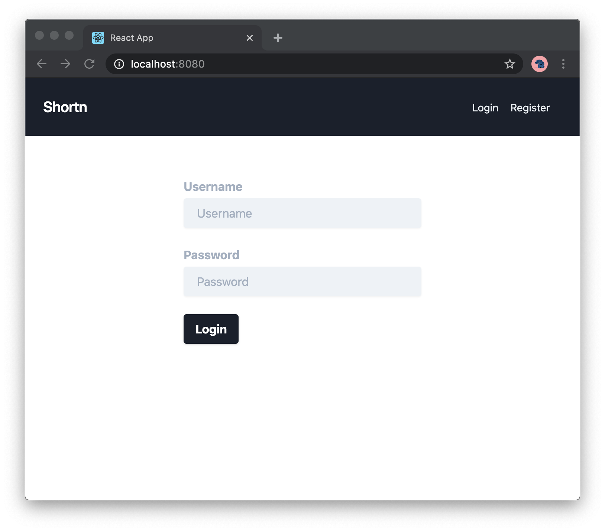

# URL shortener frontend

A simple frontend for the [shortener
backend](https://github.com/samirettali/shortener-backend) that I wrote. It uses
React and TailwindCSS.

To run it, simply clone the repository and run `npm start` in it.

# Login

# Dashboard

